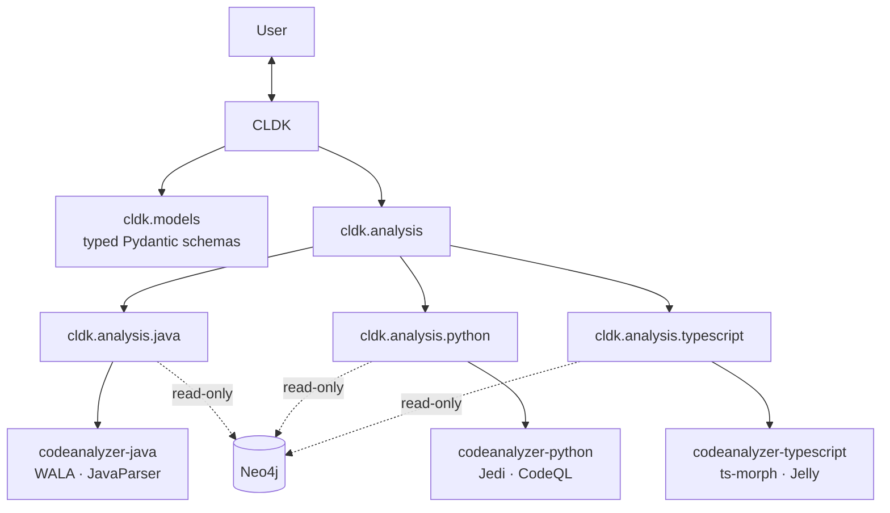

<p align='center'>
  <a href="https://arxiv.org/abs/2410.13007">
    
  </a>
  <a href="https://www.python.org/downloads/">
    
  </a>
  <a href="https://opensource.org/licenses/Apache-2.0">
    
  </a>
  <a href="https://codellm-devkit.info">
    
  </a>
  <a href="https://badge.fury.io/py/cldk">
    
  </a>
  <a href="https://discord.gg/zEjz9YrmqN">
    
  </a>
</p>

# Codellm-Devkit (CLDK)

**A unified, multilingual program-analysis SDK for Code LLMs.** CLDK turns raw source code into structured, LLM-ready program facts — symbol tables, call graphs, type hierarchies, and more — behind a single Python API, so you can build analysis-augmented LLM pipelines without wrangling a different static-analysis tool for every language.

Under the hood, CLDK orchestrates mature analysis engines (WALA, Tree-sitter, Jedi, CodeQL, ts-morph) and normalizes their output into consistent, typed [Pydantic](https://docs.pydantic.dev/) models. You get the same ergonomic interface whether you are analyzing Java, Python, or TypeScript.

CLDK is:

- **Unified** — one framework and one mental model across languages and analysis backends.
- **Extensible** — designed to take on new languages, engines, and graph backends (e.g. Neo4j).
- **Streamlined** — raw code in, structured LLM-ready facts out, with the tooling complexity hidden.

> Developed at IBM Research. CLDK is an actively evolving project — issues and contributions are welcome.

## Table of Contents

- [Cited By](#cited-by)
- [Installation](#installation)
- [Quick Start](#quick-start)
- [Supported Languages & Backends](#supported-languages--backends)
- [Architecture](#architecture)
- [Documentation](#documentation)
- [Contributing](#contributing)
- [Citation](#citation)
- [Maintainers](#maintainers)

## Installation

```bash
pip install cldk
```

Optional extras:

```bash
pip install "cldk[neo4j]"   # read-only Neo4j graph backend (Java / Python / TypeScript)
```

## Quick Start

Create a language-specific analysis facade with the per-language factory methods, then query it:

```python
from cldk import CLDK

# Pick a language — each returns a typed analysis facade.
analysis = CLDK.java(project_path="/path/to/java/project")
# analysis = CLDK.python(project_path="/path/to/python/project")
# analysis = CLDK.typescript(project_path="/path/to/ts/project")
```

Walk the symbol table and pull method bodies:

```python
from cldk import CLDK

analysis = CLDK.java(project_path="/path/to/java/project")

for file_path, class_file in analysis.get_symbol_table().items():
    for type_name, type_declaration in class_file.type_declarations.items():
        for method in type_declaration.callable_declarations.values():
            body = analysis.get_method_body(method.declaration)
            print(f"{type_name}.{method.declaration}\n{body}\n")
```

Build a call graph by raising the analysis level:

```python
from cldk import CLDK
from cldk.analysis import AnalysisLevel

analysis = CLDK.python(
    project_path="/path/to/python/project",
    analysis_level=AnalysisLevel.call_graph,
)
call_graph = analysis.get_call_graph()  # a networkx.DiGraph
```

Select a backend by passing a typed config. For example, query a pre-populated graph **read-only** over Neo4j (no source or analyzer run needed):

```python
from cldk import CLDK
from cldk.analysis.commons.backend_config import Neo4jConnectionConfig

analysis = CLDK.python(
    backend=Neo4jConnectionConfig(
        uri="bolt://localhost:7687",
        application_name="my-app",  # the graph is populated out of band
    ),
)
classes = analysis.get_all_classes()
```

> **`project_path` with the Neo4j backend:** it's **optional** — the graph is read over Bolt, so you can omit it as shown above. CLDK validates `project_path` only when you actually pass one (it must exist and be a directory, on every backend); passing `None` skips that check. Supply a real path only if you also need on-disk source access (e.g. file content/snippets) alongside the graph.

> **Deprecation:** the old `CLDK(language="java").analysis(...)` entry point still works as a thin compatibility shim (it emits a `DeprecationWarning`). Prefer the `CLDK.java()` / `CLDK.python()` / `CLDK.typescript()` factory methods.

## Supported Languages & Backends

Each language is analyzed by a dedicated `codeanalyzer-*` engine; CLDK normalizes the result into typed models exposed through the same API. All three also support an optional **read-only Neo4j backend** — pass a `Neo4jConnectionConfig` and the SDK answers the same queries with Cypher over a graph the analyzer populates out of band (`--emit neo4j`).

| Language | Analysis engine | What it provides |
| --- | --- | --- |
| **Java** | [`codeanalyzer-java`](https://github.com/codellm-devkit/codeanalyzer-java) | WALA + JavaParser. Bytecode-level call graphs, type hierarchies, symbol resolution, CRUD-operation and entry-point detection. Optional read-only **Neo4j** graph backend. |
| **Python** | [`codeanalyzer-python`](https://github.com/codellm-devkit/codeanalyzer-python) | Jedi with optional CodeQL augmentation. Symbol tables, call graphs, and class/method resolution. Optional read-only **Neo4j** graph backend. |
| **TypeScript / JavaScript** | [`codeanalyzer-typescript`](https://github.com/codellm-devkit/codeanalyzer-typescript) | ts-morph with Jelly-based call graphs. Symbols, call graph, types, decorators, and call sites. Optional read-only **Neo4j** graph backend. |

The backend is selected by the **type** of the `backend=` config you pass to a factory: the in-process analyzer (default) or a `Neo4jConnectionConfig` for the read-only graph backend.

> **Analysis cache (Python):** caching is owned by `codeanalyzer-python` — the backend virtualenv, CodeQL database, and analysis cache live under `cache_dir` (default `<project>/.codeanalyzer`). CodeQL is on by default, so the first run is slow (it provisions a CodeQL DB) and later runs reuse a checksum-validated cache. Add the cache directory to your `.gitignore`.

## Architecture

The user interacts only with the top-level `CLDK` interface (`core.py`), which configures the session, initializes the language-specific pipeline, and exposes a high-level, language-agnostic API. Each language module is built from two pieces: **data models** and an **analysis backend**.



**Data models** — each language has its own set of Pydantic models under `cldk.models` (`cldk.models.java`, `cldk.models.python`, `cldk.models.typescript`). They give you structured, typed, dot-accessible representations of classes, methods, fields, and statements, with JSON serialization and shared conventions across languages.

**Analysis backends** — each language has a backend under `cldk.analysis.<language>` that coordinates its engine (see the table above) and maps the result onto the data models. The read-only Neo4j backends (`cldk.analysis.<language>.neo4j`) reconstruct the *same* models from a Cypher graph, so they are drop-in interchangeable with the in-process analyzers. Backends are orchestrated internally; you only call high-level methods such as `get_symbol_table()`, `get_method_body(...)`, and `get_call_graph(...)`, and CLDK handles tool coordination, parsing, and marshalling under the hood.

## Documentation

Full documentation lives at **[codellm-devkit.info](https://codellm-devkit.info)**.

## Contributing

We welcome contributors of all experience levels — see the [CONTRIBUTING](./CONTRIBUTING.md) guide to get started.

## Citation

If you use CLDK in your research, please cite:

```bibtex
@article{krishna2024codellm,
  title   = {Codellm-Devkit: A Framework for Contextualizing Code LLMs with Program Analysis Insights},
  author  = {Krishna, Rahul and Pan, Rangeet and Pavuluri, Raju and Tamilselvam, Srikanth and Vukovic, Maja and Sinha, Saurabh},
  journal = {arXiv preprint arXiv:2410.13007},
  year    = {2024}
}
```

## Cited By

CLDK ([Krishna et al., 2024](https://arxiv.org/abs/2410.13007)) is used and cited in a growing body of research on program analysis and code LLMs:

- **SAINT: Service-Level Integration Test Generation with Program Analysis and LLM-Based Agents** — Pan, Pavuluri, Huang, Krishna et al. (2026). *ICSE*. [arXiv:2511.13305](https://arxiv.org/abs/2511.13305)
- **RECON: An LLM-Enhanced Backward Constraint Analysis Framework** — Bappah et al. (2026). [arXiv:2606.10264](https://arxiv.org/abs/2606.10264)
- **Architecting Open, Accountable, and Trustworthy AI-IDEs** — Contreras, Guerra & de Lara (2026). *Automated Software Engineering*. [doi:10.1007/s10515-026-00608-x](https://doi.org/10.1007/s10515-026-00608-x)
- **Resolving Java Code Repository Issues with iSWE Agent** — Ganhotra et al. (2026). [arXiv:2603.11356](https://arxiv.org/abs/2603.11356)
- **HookLens: Visual Analytics for Understanding React Hooks Structures** — Hwang et al. (2026). *IEEE PacificVis*. [arXiv:2602.17891](https://arxiv.org/abs/2602.17891)
- **ASTER: Natural and Multi-Language Unit Test Generation with LLMs** — Pan, Kim, Krishna, Pavuluri & Sinha (2025). *ICSE-SEIP*. [arXiv:2409.03093](https://arxiv.org/abs/2409.03093)
- **PRAXIS: Integrating Program Analysis with Observability for Root-Cause Analysis** — Cui, Krishna & Jha et al. (2025). [arXiv:2512.22113](https://arxiv.org/abs/2512.22113)
- **Examining Software Developers' Needs for Privacy Enforcing Techniques: A Survey** — Theophilou & Kapitsaki (2025). *ACM SAC*. [arXiv:2512.14756](https://arxiv.org/abs/2512.14756)
- **LLM as an Execution Estimator: Recovering Missing Dependency for Practical Time-Travelling Debugging** — Pei, Wang & Zhang et al. (2025). [arXiv:2508.18721](https://arxiv.org/abs/2508.18721)
- **Agentic Multi-Modal LLMs for Software Comprehension: Structuring Code Summarization with Business Process Awareness** — Tamilselvam & Saxena (2025). *IEEE SSE*. [doi:10.1109/SSE67621.2025.00024](https://doi.org/10.1109/SSE67621.2025.00024)
- **Phaedrus: Predicting Dynamic Application Behavior with Lightweight Generative Models and LLMs** — Chatterjee, Jadhav & Pande (2024). *PACMPL (OOPSLA)*. [arXiv:2412.06994](https://arxiv.org/abs/2412.06994)

<sub>List compiled from Semantic Scholar / OpenAlex citation data; please open a PR to add a missing paper.</sub>

Related publications:

1. Pan, Rangeet, Myeongsoo Kim, Rahul Krishna, Raju Pavuluri, and Saurabh Sinha. "[Multi-language Unit Test Generation using LLMs.](https://arxiv.org/abs/2409.03093)" arXiv preprint arXiv:2409.03093 (2024).
2. Pan, Rangeet, Rahul Krishna, Raju Pavuluri, Saurabh Sinha, and Maja Vukovic. "[Simplify your Code LLM solutions using CodeLLM Dev Kit (CLDK).](https://www.linkedin.com/pulse/simplify-your-code-llm-solutions-using-codellm-dev-kit-rangeet-pan-vnnpe/)" Blog.

## Maintainers

| Name | Email |
| --- | --- |
| Rahul Krishna | [i.m.ralk@gmail.com](mailto:imralk+oss@gmail.com) |
| Rangeet Pan | [rangeet.pan@ibm.com](mailto:rangeet.pan@gmail.com) |
| Saurabh Sinha | [sinhas@us.ibm.com](mailto:sinhas@us.ibm.com) |

Licensed under the [Apache License 2.0](./LICENSE).
