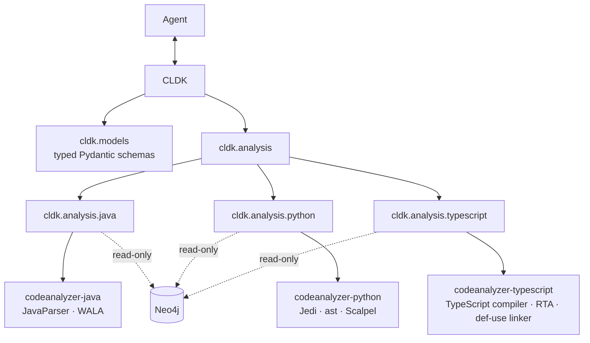

# Architecture of the Python SDK

This page is for contributors who change the SDK. Users start at the [README](../README.md).

The `CLDK` factories in `core.py` are the entry point. A factory validates its arguments. It selects a backend by the type of the `backend=` configuration. It then returns the analysis facade for the language. Each language package has two parts: **data models** and an **analysis backend**.

**Data models** live under `cldk.models.<language>`. They mirror canonical schema v2 as Pydantic models for modules, types, callables, fields, statements, artifacts, and dependencies. The projections (`*CallableOverview`, `*ClassOverview`) are the lightweight forms the bulk accessors return.

**Analysis backends** live under `cldk.analysis.<language>`. A shared `AnalysisBackend` ABC in `cldk.analysis.commons` declares the core accessors and the artifact, dependency, and configuration accessors. Each language subclasses it once for the local analyzer and once for Neo4j. The local backend runs the analyzer and maps its output onto the models. The Neo4j backend reconstructs the same models from the graph. Both backends therefore answer the same accessors.

**Shared result types** live in `cldk.analysis.commons.results` and `cldk.analysis.commons.bounds`: `LocateResult`, `EdgePage`, `Slice`, `FlowPaths`, `TaintResult`, `EntrypointCoverage`, `Diagnostic`, and the default bounds.
